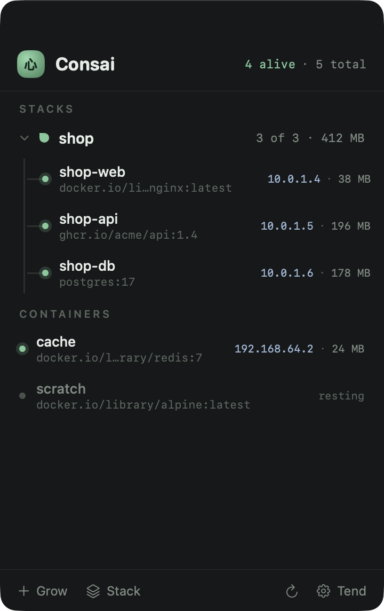
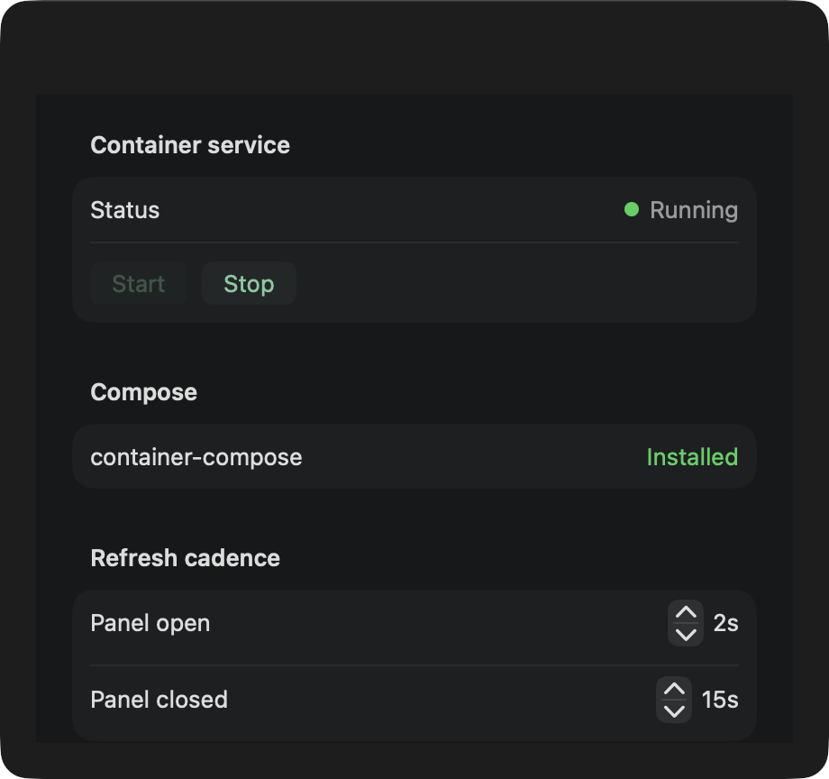
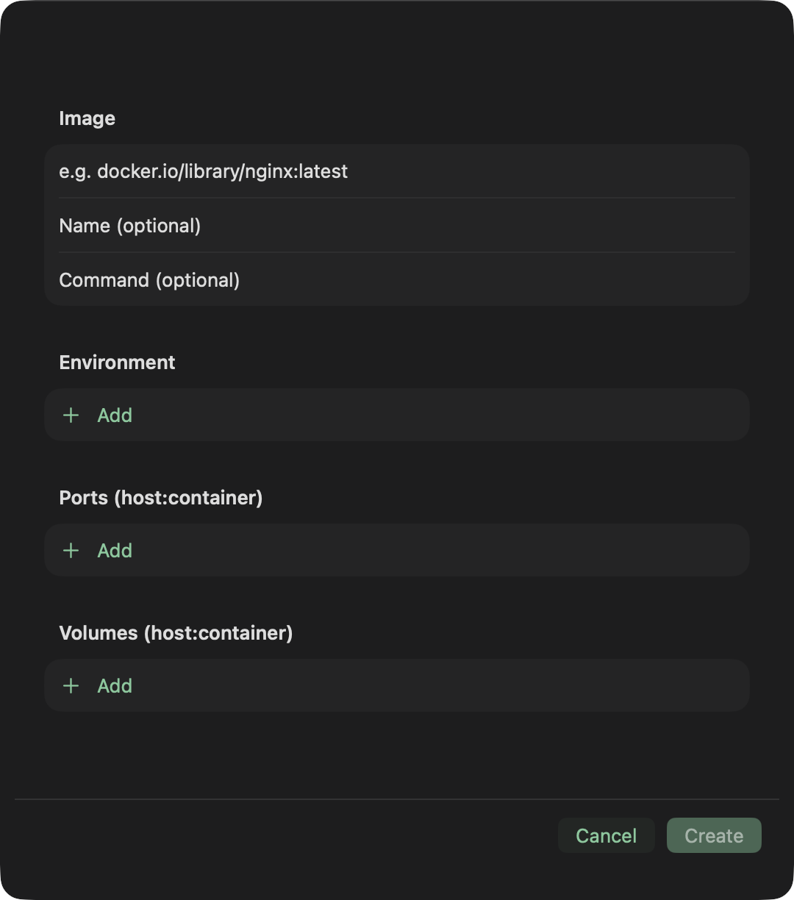

# Consai 🌳📦

A **menu-bar-first** macOS app for [Apple's `container`](https://github.com/apple/container).
The lightweight companion to full GUIs like [Orchard](https://github.com/andrew-waters/orchard):
glance at your containers — grouped into compose stacks — and act, right from the menu bar.

> **Consai** = **con**tainer + bon**sai** — a small, contained tree.

## Status

Early scaffold. Design is approved; implementation is organized into waves.
See [`specs/`](specs/) (start with [`specs/00-design.md`](specs/00-design.md)).

## Requirements

- macOS 26 (Tahoe), Xcode 26 / Swift 6.2
- [`container`](https://github.com/apple/container) installed + its system service running
- [`container-compose`](https://github.com/Mcrich23/Container-Compose) — optional, for stacks
  (`brew install container-compose`)

## Build

Consai builds with **SwiftPM** (not an `.xcodeproj` — see `CLAUDE.md` R11):

```bash
swift build                  # build the app
swift run bundle             # build + assemble a runnable Consai.app, then: open Consai.app
swift test                   # ConsaiCore unit tests (no container needed)
swift run coverage           # after `swift test --enable-code-coverage`: print coverage report
open Package.swift           # Xcode GUI development (uses SwiftPM's build)
```

Build tooling (`bundle`, `icon`, `coverage`) is native Swift — executable targets under
`Tools/`, run with `swift run <name>` — not shell scripts.

## Screenshots

Captured live against a real `container` daemon (`Consai --render-shots <dir>` hosts the
real views in windows and `screencapture`s them):

| Panel | Settings | New container |
|---|---|---|
|  |  |  |

## Testing

```bash
swift test                       # unit tests (pure ConsaiCore, no daemon)

# End-to-end against a LIVE daemon (creates + deletes throwaway consai-e2e-* containers,
# pulls alpine, runs a real compose up/down). Requires `container` running + container-compose.
CONSAI_E2E=1 swift test
```

E2E is gated behind `CONSAI_E2E=1` and is destructive (throwaway resources only — never
touches containers it didn't create). It verifies the real SDK lifecycle (create/start/
stop/delete), service status, and compose grouping. **Note:** the SDK library version must
match your installed daemon (see `CLAUDE.md` R1) — a skew surfaces as XPC decode errors.

## Architecture

- **`ConsaiCore`** — UI-free Swift package: container/compose engines (behind protocols),
  stack-assembly, service health. Reusable by a future full app.
- **`Consai`** (`App/`) — thin SwiftUI `MenuBarExtra` layer.

See [`CLAUDE.md`](CLAUDE.md) for the risk register and conventions.

## License

MIT — see [`LICENSE`](LICENSE).
