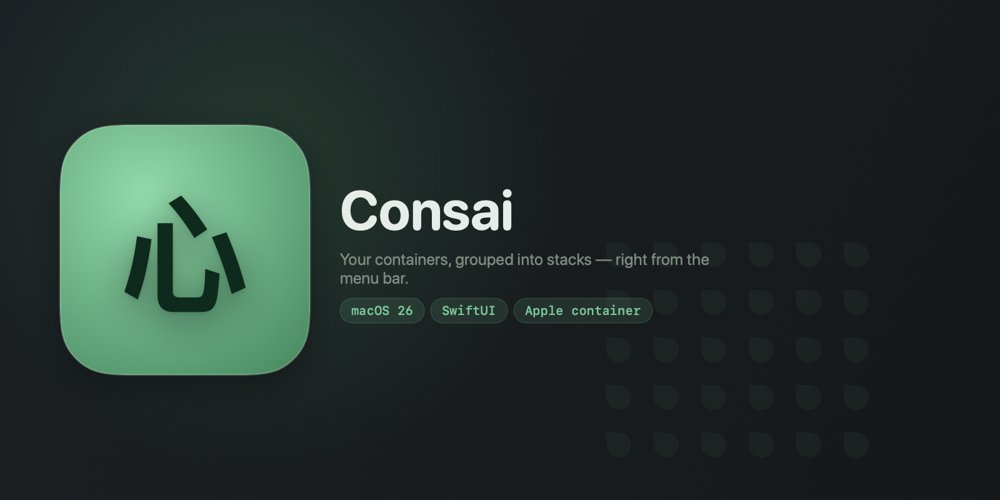

# Consai 🌳

**A menu-bar-first macOS app for managing [Apple `container`](https://github.com/apple/container)
and `container-compose` stacks — glance, act, done.**

[](#requirements)
[](#requirements)
[](#)
[](#license)
[](https://github.com/DonsWayo/consai)

<p align="center">
  
</p>

> **Consai** = **con**tainer + bon**sai** — a small, contained tree.

## Why Consai?

Stop alt-tabbing to a terminal or opening a full-window GUI just to check on a container.
Consai lives in your menu bar: see every container — grouped into the compose stack it
belongs to — with live CPU, memory, and IP. One click to start, stop, restart, delete, view
logs, or open a shell. Open the pop-out panel for the full garden.

- **Menu-bar native** — `LSUIElement` SwiftUI app, no Dock icon, no windowing overhead
- **Compose stacks** — projects launched through Consai are tracked reliably; external
  containers can be grouped by name prefix (off by default)
- **Live without polling hard** — adaptive intervals (2s open, 15s closed) + immediate
  re-poll after every action
- **Degrades gracefully** — works without `container-compose`; surfaces a clear setup
  banner on a fresh machine
- **No Docker, no Docker Desktop** — talks directly to Apple's `container` daemon via the
  official Swift SDK

Lightweight companion to full GUI tools like [Orchard](https://github.com/andrew-waters/orchard).

## Screenshots

<p align="center">
  
  
  
</p>

## Requirements

- **macOS 26 (Tahoe)** — `container` only ships here
- **Xcode 26 / Swift 6.2** — required to build (uses the `apple/container` Swift 6.2 package)
- [`container`](https://github.com/apple/container) installed and its system service running
- [`container-compose`](https://github.com/Mcrich23/Container-Compose) — *optional*, for
  stack features (`brew install container-compose`). Consai degrades gracefully without it.

## Install

```bash
# Once packaged (release artifact pending): Homebrew cask — see packaging/consai.rb
brew install --cask DonsWayo/consai/consai
```

## Build from source

Consai builds with **SwiftPM** (not an `.xcodeproj` — see [`CLAUDE.md`](CLAUDE.md) R11):

```bash
swift build                  # build the app
swift run bundle             # build + assemble a runnable Consai.app, then: open Consai.app
swift test                   # unit tests (no container daemon needed)
swift run coverage           # after `swift test --enable-code-coverage`: print coverage report
open Package.swift           # Xcode GUI development (uses SwiftPM's build)
```

Build tooling (`bundle`, `icon`, `hero`, `coverage`) is native Swift — executable targets
under `Tools/`, run with `swift run <name>`. No shell scripts.

## Testing

```bash
swift test                       # unit tests (pure logic, no daemon)

# End-to-end against a LIVE daemon (creates + deletes throwaway consai-e2e-* containers,
# pulls alpine, runs a real compose up/down). Requires `container` running + container-compose.
CONSAI_E2E=1 swift test
```

E2E is gated behind `CONSAI_E2E=1` and is destructive (throwaway resources only — never
touches containers it didn't create). It verifies the real SDK lifecycle (create/start/
stop/delete), service status, and compose grouping. **Note:** the SDK library version must
match your installed daemon (see [`CLAUDE.md`](CLAUDE.md) R1) — a skew surfaces as XPC
decode errors.

## Architecture

- **`ConsaiCore`** — UI-free Swift package: container/compose engines (behind protocols),
  stack-assembly, service health. Reusable by a future full app.
- **`ConsaiKit`** — orchestration layer (`AppState`, mock engines) for the menu-bar app;
  unit-testable with no daemon.
- **`Consai`** (`App/`) — thin SwiftUI `MenuBarExtra` layer.

See [`CLAUDE.md`](CLAUDE.md) for the risk register and conventions, and [`specs/`](specs/)
for the design and implementation waves.

## Contributing

Issues and PRs welcome. Before opening one, read [`CLAUDE.md`](CLAUDE.md) — particularly
R1 (SDK pin matches your daemon) and R11 (SwiftPM, not `.xcodeproj`). The build is fast
after the first run.

## License

MIT — see [`LICENSE`](LICENSE).
